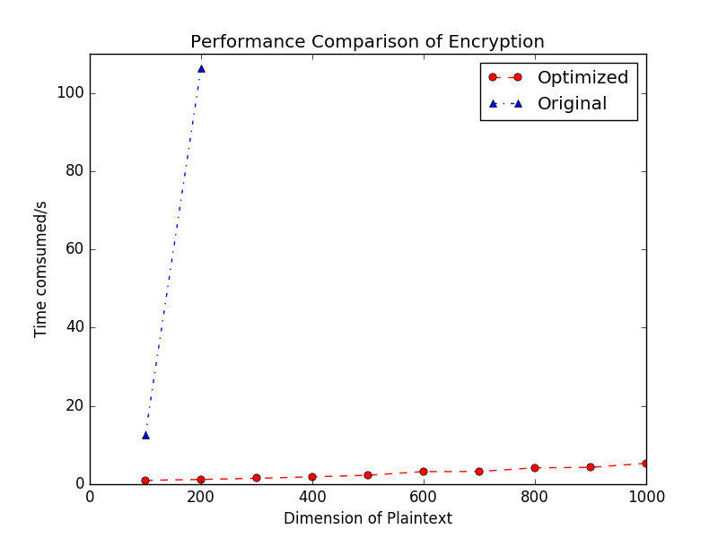
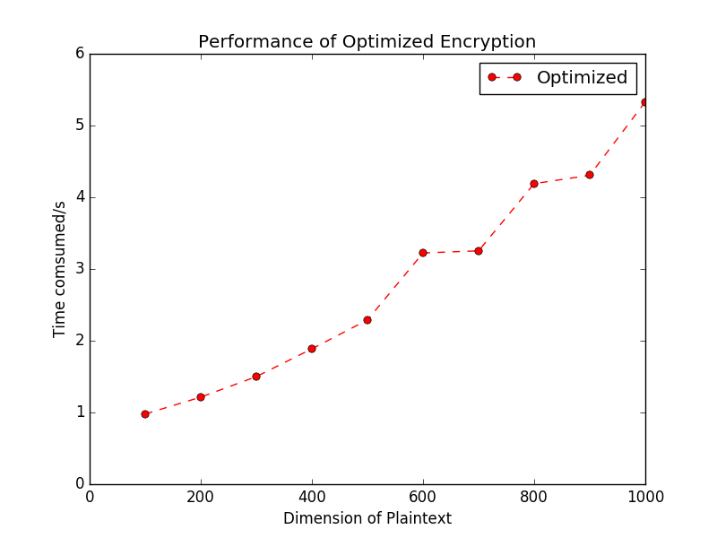
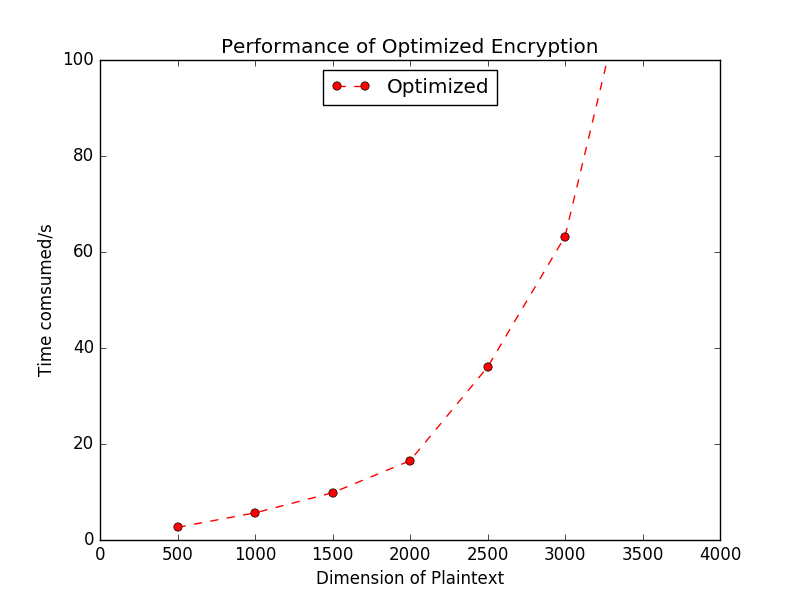
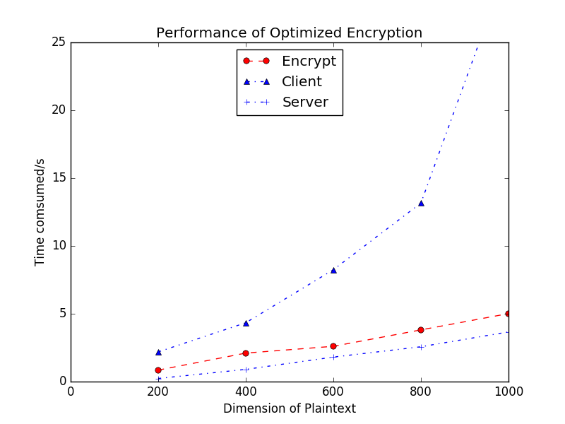
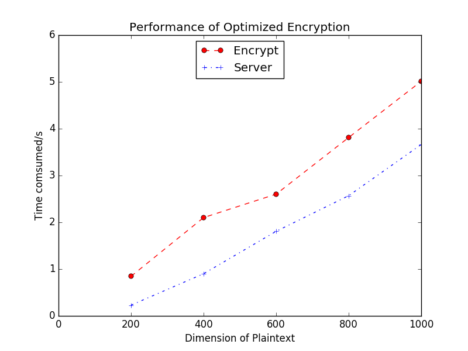

## Performance Report
By _Xin Wang_ 1st Jan, 2016
### Introduction
This Homomorphic Encryption Scheme for Vector Computations is inherently based on
lattice, and the security of it is based on LWE problem, which is one of the hard
lattice problems but relatively easier to be used to construct encryption scheme.
It is intuitive and direct to do vector computations on it. Encryption with it is
supposed to be efficient. "Matrix multiplication" naturally is the
most time-comsuming part. That's bottleneck that should be optimized.

### Performance Comparison
#### Performance Comparison of Different Implementation

[Original implementation](https://github.com/jamespayor/vector-homomorphic-encryption), using ntl library for linear algebraic operations, coupled with GMP for large integer computations, is very slow. I rewrite it with the Intel MKL(Math Kernel Library), it shows a great improvement in performance.

#### Performance Comparison of Different Dimensions for Optimized Version
As to the optimized version itself, encryption will completed in 6 seconds when the dimension is less than 1000. If the dimension is up to 3000, it will take about 60 seconds to encrypt.

#### Performance Comparison of Different Operations for Optimized Version
The figure below shows that when computing the inner product of the two vectors on their ciphers, it's relatively time-comsuming for client-side to compute the transformation matrix M. But the time needed for server to make the transformation(i.e to compute) is lower than the encryption, which is reasonable because encryption basically is just a key-switch with some preparations and server just execute the key-switch .  

The great thing is transformation matrix M can be computed for only once before the transformation. So the focus should be the time consumed by the server. Figure below shows some results.

